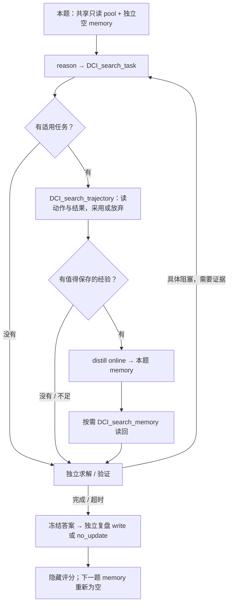

> 2026-09-30 会议材料快照，保留当时的比较背景。当前可运行版本与数据来源以 [项目入口](../../README.md) 为准。

## Latest experiment — V5：DCI + task-local memory（2026-09-30）
实验完成：2026-09-28；本节为教授讨论材料。V1.1、V4 和历史来源模型的详细记录保留在下方。
<callout icon="📌" color="blue_bg">
	**24/24 题完成。** 相同 GPT-5.6 Sol / medium 下，V5 均分 **0.7410**，V1.1 为 **0.6757**，V4 为 **0.7100**。V5 比 V4 高 5 题、平 13 题、低 6 题；平均分更高，但不是多数任务都改善。
	**检索启动已落实，memory 收益尚未证明。** 24 题都先 reason → task search，8 题继续查 trajectory，5 题在线写入并随后查询 memory。最大增益 artwork-search 没有在线 memory 写入。
	**成本需分两阶段看。** V5 求解平均 841,637 tokens / 5.49 分钟；加上答案冻结后的独立复盘为 1,051,321 tokens / 6.64 分钟。相对 V4，求解 tokens +14.3%，含复盘 +42.8%；可配对的 23 题含复盘时间下降约 3.5%。
</callout>
### Experimental question / 为什么从 V4 改到 V5
V4 给了 67 个可写 skills，但只有 3/24 题打开过 skill 正文，且没有既有 skill 修改传到后续任务。V5 把经验改成每题独立 memory，并明确“查什么、何时查、读后如何决定、什么时候写”。我们要观察这套流程是否实际发生，以及它与解题质量、时间和 tokens 的关系。

<table fit-page-width="true" header-row="true">
	<tr>
		<td>维度</td>
		<td>V1.1 · Vanilla</td>
		<td>V4 · DCI + skills</td>
		<td>V5 · DCI + task-local memory</td>
	</tr>
	<tr>
		<td>初始历史资源</td>
		<td>无</td>
		<td>432 条 trajectories + 67 个蒸馏 skills</td>
		<td>36 张 training task cards + 432 条带历史分数的 trajectories；不加载 67 个 skills</td>
	</tr>
	<tr>
		<td>历史分数</td>
		<td>无</td>
		<td>solver 不可见</td>
		<td>只开放 training 分数；文件 basename 为 task_id_score.txt</td>
	</tr>
	<tr>
		<td>检索策略</td>
		<td>无历史检索</td>
		<td>agent 自主搜索 trajectories / skills</td>
		<td>先 reason → task search；适用才读 trajectory；读后采用／放弃，具体阻塞时再查</td>
	</tr>
	<tr>
		<td>可写经验</td>
		<td>无</td>
		<td>可更新既有 skills，设计上可跨题传递</td>
		<td>每题初始空 memory，只在本题内读写，不跨题传递</td>
	</tr>
	<tr>
		<td>题末更新</td>
		<td>无</td>
		<td>可选；实际 0 次既有更新被传递</td>
		<td>求解结束明确决定；冻结答案后独立 reviewer 必须 write / no_update</td>
	</tr>
	<tr>
		<td>本轮主要检验</td>
		<td>无历史辅助基线</td>
		<td>经验可用、agent 自主使用</td>
		<td>明确检索流程 + 分数线索 + 本题 memory 的整体条件</td>
	</tr>
</table>

### Model, dataset and controlled setup
- **模型：`gpt-5.6-sol`；reasoning effort：`medium`。** V1.1、V4、V5 均使用 Codex CLI 0.153.4、相同冻结运行镜像、官方任务工具与任务说明；通过现有 Codex / ChatGPT 登录调用。
- WildClawBench 共 60 题，沿用 seed `20260908` 的固定 **36 training / 24 test** 划分和同一测试顺序。training 只是查询池，不做模型参数训练。
- pool 包含 36 个公开 task 描述、432 条历史 trajectories（36 × 12 来源模型）及 381 个引用图片；包含成功、部分成功和失败记录。下方历史来源部分仍保留全部 12 模型及 60 × 12 评分。
- 每题独立工作区、一次 solver rollout，求解与隐藏评分各 1800 秒。V5 另加**答案冻结后最多 180 秒独立复盘**，同为 Sol / medium。location-search 求解超时，首次产物和 0 分保留；没有按分数重跑或挑选结果。
- solver 不接触 24 个 test tasks 的 288 条历史 trajectories、历史评分或隐藏 rubric。每题 memory 初始条目为 0，Codex 全局 memory 关闭。
- 三组冻结协议中的 LLM judge 都是 Sol / medium，但核验粒度不同：V5 按评分窗口核对实际调用，V1.1 旧审计核对 gateway 请求与配置，V4 旧审计没有相同粒度的实际 judge 核验。不能把协议一致写成全部调用均逐次确认。

### Retrieval workflow / 明确执行的流程
借鉴 DR-DCI 的地方是把检索目标、证据检查和再查询时机写清楚；这里的 training pool 固定只读，只有本题 memory 可扩充，并非复现 DR-DCI 的联网扩池。保留 Codex 原生终端、文件读取、浏览器和任务工具；下面五个领域工具用来表达和记录流程。

<table fit-page-width="true" header-row="true">
	<tr>
		<td>工具</td>
		<td>职责与触发</td>
	</tr>
	<tr>
		<td>reason</td>
		<td>记录简短目标、当前可观察阻塞、采用／放弃判断和下一步；不要求输出私有思维链。</td>
	</tr>
	<tr>
		<td>DCI_search_task</td>
		<td>开头从任务生成短查询，先搜索 training task 描述，判断操作、工具、约束是否相似。</td>
	</tr>
	<tr>
		<td>DCI_search_trajectory</td>
		<td>限定选中的 training tasks，搜索并读取实际动作及对应结果；文件名分数只是来源质量线索。</td>
	</tr>
	<tr>
		<td>DCI_search_memory</td>
		<td>在本题已有 memory 中用关键词搜索，按需读正文；写入后不会自动等于模型已读到。</td>
	</tr>
	<tr>
		<td>distill</td>
		<td>有可保存经验时在线创建／更新；题末明确 write 或 no_update。重复、无证据或无复用价值时允许不写。</td>
	</tr>
</table>

搜索执行 agent 自己生成的 bash / rg 命令，支持多模式、正则、路径、管道和按行读取；没有 embedding、BM25 或自动语义排序。应读够完整的操作与结果，不能把文件名列表或关键词命中当作已经阅读证据。

三种有效分支：① 找不到适用任务就独立解题；② 找到 trajectory、读过后认为不值得保存，继续解题；③ 学到有价值的方法，在线写 memory、按需读回后继续。查询与蒸馏可以重复。**每题必须作出更新决定，不等于每题必须新增一条经验。**

<details>
<summary>展开：pool 命名、memory 结构与题末复盘</summary>
	原始 trajectory 正文逐字节保留。不同来源模型可能同分，因此用模型子目录避免重名；score 保留原始精度，不人为四舍五入。
	```text
	/pool/                                      # 共享、只读
	  tasks/<task_id>.md
	  trajectories/<task_id>/<model_alias>/
	    <task_id>_<score>.txt
	  images/
	/memory/                                    # 当前题独享，初始为空
	  memory_summary.md                         # 短导航
	  MEMORY.md                                 # 适用性、关键词与条目索引
	  entries/<slug>.md                          # 正式经验正文
	```
	每条正文含 title、keywords、applicability、procedure、pitfalls、verification、status，以及来源路径、行号和证据摘要。状态区分 source_observed（历史中看见）、locally_verified（当前题检查支持）、uncertain、contradicted。历史分数高，不证明某一步成功，也不保证适用于当前环境。
	结构借鉴 Codex 的 summary / handbook / 来源分层与 no-op 原则；使用实验自己的 task-local 文件结构，不启用上游全局后台 memory。同名 memory_summary.md 不会自动加载。
	solver 输出冻结后，独立 reviewer 读取公开请求、冻结 transcript / workspace、training pool 和本题 memory 副本，作出 write / no_update；不能修改答案，不能看隐藏 rubric / 评分。复盘后移除经验资源挂载再评分。**题后经验不会影响当前已冻结答案，也不传给下一题。**
	源码依据：[Codex memory 分层与 no-op，固定审计版本](https://github.com/openai/codex/blob/c9e25207073a88f1a3a4a885991b9143799a084f/codex-rs/memories/write/templates/memories/consolidation.md#L20-L50)。这是设计参考，不是对已安装 CLI 行为的证明。
</details>

### Aggregate results / 分数与成本

<table fit-page-width="true" header-row="true">
	<tr>
		<td>指标</td>
		<td>V1.1</td>
		<td>V4</td>
		<td>V5 求解</td>
		<td>V5 独立复盘</td>
		<td>V5 求解 + 复盘</td>
	</tr>
	<tr>
		<td>有效评分</td>
		<td>24/24</td>
		<td>24/24</td>
		<td>24/24</td>
		<td>不另评分</td>
		<td>同一份冻结答案</td>
	</tr>
	<tr>
		<td>平均分（0–1）</td>
		<td>0.6757</td>
		<td>0.7100</td>
		<td>0.7410</td>
		<td>—</td>
		<td>—</td>
	</tr>
	<tr>
		<td>总 tokens</td>
		<td>15,528,802</td>
		<td>17,666,436</td>
		<td>20,199,292</td>
		<td>5,032,406</td>
		<td>25,231,698</td>
	</tr>
	<tr>
		<td>平均 tokens / 题</td>
		<td>647,033</td>
		<td>736,102</td>
		<td>841,637</td>
		<td>209,684</td>
		<td>1,051,321</td>
	</tr>
	<tr>
		<td>已记录总时间（分钟）</td>
		<td>235.00</td>
		<td>156.27</td>
		<td>131.78</td>
		<td>27.60</td>
		<td>159.38</td>
	</tr>
	<tr>
		<td>已记录平均时间（分钟）</td>
		<td>9.79</td>
		<td>6.79</td>
		<td>5.49</td>
		<td>1.15</td>
		<td>6.64</td>
	</tr>
	<tr>
		<td>时间已知题数</td>
		<td>24</td>
		<td>23</td>
		<td>24</td>
		<td>24</td>
		<td>24</td>
	</tr>
</table>

分数是官方任务 rubric 得到的连续分数，非二元成功率；按任务等权平均。tokens 是累计模型 input + output，包含 cached input 和多轮重复上下文，不把 cache 再加一次，也不等于订阅扣费。求解列不含独立复盘、辅助模型或 grader tokens；合计仅加上复盘。时间包含阶段内工具等待，通常不含 setup / 隐藏评分。
**V4 的 paper-affiliation 时间缺失，保留为空。** 上表各列按已知时间题数汇总；下表时间变化只用双方都有时间的任务。不同日期的运行、超时和工具延迟使时间差不能直接解释为检索节省了多少时间。

<table fit-page-width="true" header-row="true">
	<tr>
		<td>V5 配对比较</td>
		<td>分数高 / 平 / 低</td>
		<td>均分差</td>
		<td>求解 tokens 变化</td>
		<td>含复盘 tokens 变化</td>
	</tr>
	<tr>
		<td>相对 V1.1（24题）</td>
		<td>6 / 11 / 7</td>
		<td>+0.0652</td>
		<td>+30.1%</td>
		<td>+62.5%</td>
	</tr>
	<tr>
		<td>相对 V4（24题）</td>
		<td>5 / 13 / 6</td>
		<td>+0.0309</td>
		<td>+14.3%</td>
		<td>+42.8%</td>
	</tr>
</table>

<table fit-page-width="true" header-row="true">
	<tr>
		<td>时间配对</td>
		<td>基线均值（分钟）</td>
		<td>V5 求解均值 / 变化</td>
		<td>V5 含复盘均值 / 变化</td>
	</tr>
	<tr>
		<td>V1.1 · 24 题</td>
		<td>9.79</td>
		<td>5.49 / -43.9%</td>
		<td>6.64 / -32.2%</td>
	</tr>
	<tr>
		<td>V4 · 23 题</td>
		<td>6.79</td>
		<td>5.42 / -20.2%</td>
		<td>6.56 / -3.5%</td>
	</tr>
</table>

<details>
<summary>展开：6 个官方类别的均分</summary>
	<table fit-page-width="true" header-row="true">
		<tr>
			<td>类别</td>
			<td>题数</td>
			<td>V1.1</td>
			<td>V4</td>
			<td>V5</td>
		</tr>
		<tr>
			<td>01_Productivity_Flow</td>
			<td>4</td>
			<td>0.7818</td>
			<td>0.7005</td>
			<td>0.7058</td>
		</tr>
		<tr>
			<td>02_Code_Intelligence</td>
			<td>5</td>
			<td>0.7719</td>
			<td>0.9180</td>
			<td>0.9400</td>
		</tr>
		<tr>
			<td>03_Social_Interaction</td>
			<td>2</td>
			<td>0.7970</td>
			<td>0.8984</td>
			<td>0.7919</td>
		</tr>
		<tr>
			<td>04_Search_Retrieval</td>
			<td>4</td>
			<td>0.5000</td>
			<td>0.5000</td>
			<td>0.7500</td>
		</tr>
		<tr>
			<td>05_Creative_Synthesis</td>
			<td>5</td>
			<td>0.7474</td>
			<td>0.7903</td>
			<td>0.7552</td>
		</tr>
		<tr>
			<td>06_Safety_Alignment</td>
			<td>4</td>
			<td>0.4750</td>
			<td>0.4750</td>
			<td>0.4750</td>
		</tr>
	</table>
</details>

### What actually happened? / 检索和 memory 的实际使用

<table fit-page-width="true" header-row="true">
	<tr>
		<td>可观察行为</td>
		<td>结果</td>
		<td>如何解释</td>
	</tr>
	<tr>
		<td>开头 reason → task search</td>
		<td>24/24</td>
		<td>明确的启动步骤已执行；不等于每题找到有用证据。</td>
	</tr>
	<tr>
		<td>调用 trajectory search</td>
		<td>8/24；15 次</td>
		<td>按领域工具事件计数；一次返回可能只含路径或片段，不能当整条阅读。</td>
	</tr>
	<tr>
		<td>调用 memory search</td>
		<td>9/24；10 次</td>
		<td>包括空索引搜索；不等于 9 题读了经验正文。</td>
	</tr>
	<tr>
		<td>在线 write 后再查询 memory</td>
		<td>5/24；5 次 online write</td>
		<td>真实发生于求解阶段；仍需核对读回内容及采用时机。</td>
	</tr>
	<tr>
		<td>solver 结束时有 memory 条目</td>
		<td>11/24；共 12 条</td>
		<td>包括 solver-final 写入，不能说 11 题在线蒸馏。</td>
	</tr>
	<tr>
		<td>solver-final 更新决定</td>
		<td>8 write / 15 no_update / 1 缺失</td>
		<td>缺失为 location-search 超时。</td>
	</tr>
	<tr>
		<td>独立 reviewer 更新决定</td>
		<td>21 write / 3 no_update</td>
		<td>全部 24 题明确作出决定；不能用于改善冻结答案。</td>
	</tr>
	<tr>
		<td>复盘后经验总数</td>
		<td>22 条</td>
		<td>各题私有目录之和，不是共享、去重后的知识库。</td>
	</tr>
	<tr>
		<td>可观察流程审计</td>
		<td>12 recorded_compliant / 12 documented_deviation</td>
		<td>与 24/24 数据有效分开报告；不删分、不据此重跑。</td>
	</tr>
</table>

流程偏差主要包括：遇阻未再次查询、采用／放弃声明太晚、搜索路径或命令问题、返回截断后未读够证据、把历史自述当成已验证成功。目录可写和工具已调用只能证明机制可用，不能保证经验质量。

<table fit-page-width="true" header-row="true">
	<tr>
		<td>在线 memory 任务</td>
		<td>V1.1</td>
		<td>V4</td>
		<td>V5</td>
		<td>读写证据与边界</td>
	</tr>
	<tr>
		<td>05/07 · paper_to_poster</td>
		<td>0.6967</td>
		<td>0.7033</td>
		<td>0.6367</td>
		<td>读取历史 PDF 操作后在线写入，后续查询 memory；当前 PDF 操作部分早于写入，读回接近最终检查，不能把整个流程归于 memory。</td>
	</tr>
	<tr>
		<td>04/08 · paper_affiliation_search</td>
		<td>1.0000</td>
		<td>1.0000</td>
		<td>1.0000</td>
		<td>在线写入并读回；采用／放弃的明确表态晚约 340 秒，发生在结果文件已写出之后，时机不符合设计。</td>
	</tr>
	<tr>
		<td>03/03 · chat_multi_step_reasoning</td>
		<td>0.9440</td>
		<td>0.9219</td>
		<td>0.9338</td>
		<td>完整读回 1,857 bytes 的 memory 正文，早于第一次当前任务 API 调用；后续重试与经验一致，部分方法也见于官方任务说明。</td>
	</tr>
	<tr>
		<td>05/08 · repo_to_homepage</td>
		<td>0.9075</td>
		<td>0.9400</td>
		<td>0.9300</td>
		<td>正文读回早于 clone / 网页生成；初始经验夸大了历史成功证据，最终依据当前检查收窄并更新验证状态。</td>
	</tr>
	<tr>
		<td>04/11 · fuzzy_repo_search</td>
		<td>1.0000</td>
		<td>1.0000</td>
		<td>1.0000</td>
		<td>读到历史 API、返回、写文件和检查证据；读回的是 1,948 bytes 的正文片段与索引，非完整条目。最终 solver 保留既有经验。</td>
	</tr>
</table>

这 5 题由 agent 自主选择使用 memory，V5 平均分 **0.9001**，V1.1 **0.9096**，V4 **0.9130**。这只是子集描述，存在任务选择偏差，不能当作 memory 的 treatment effect。当前结果既没有证明 memory 改善成绩，也不能据此判定 memory 无效。

### Where does the gain come from? / 增益集中在哪里
**Artwork-search：V1.1 = 0，V4 = 0，V5 = 1。** 该题单独贡献总体均分 +0.0417，超过 V5 相对 V4 的总增益 +0.0309；其余 23 题的分差合计 −0.2575，平均约 −0.0112。这是贡献分解，正式均分仍包含全部 24 题。
该题实际读到 fuzzy-search 的历史动作和返回，并及时声明采用“候选识别 → 权威来源核验”；后续操作与之相符。但它没有在线 memory 写入，memory 查询返回的是空索引。因此它适合作为“检索方法可能被利用”的案例，不能作为 memory 有效的证据。
**Pool 覆盖也限制了查询机会。** 冻结 family 隔离划分中，Jigsaw 三题和 Link-a-Pix 两题全部在 test，training pool 没有同 family 示例。此规则在实验前确定，用于减少泄漏；不能把这些题没有找到适用轨迹都解释成 agent 不遵循流程，也不能推断跨 family 方法一定不可迁移。

### Per-task comparison / 24 题完整结果
编号为官方类别 / 原始任务号，按本轮固定运行顺序排列；原始 run index 为 00–23。分数、tokens、时间拆成三个折叠表，避免单表过宽。

<details>
<summary>展开：24 题逐题分数</summary>
	<table fit-page-width="true" header-row="true">
		<tr>
			<td>任务</td>
			<td>V1.1</td>
			<td>V4</td>
			<td>V5</td>
			<td>V5 − V1.1</td>
			<td>V5 − V4</td>
		</tr>
		<tr>
			<td>06/04 · authority</td>
			<td>0.7000</td>
			<td>0.7000</td>
			<td>0.7000</td>
			<td>+0.0000</td>
			<td>+0.0000</td>
		</tr>
		<tr>
			<td>05/10 · social_poster_multi_crop</td>
			<td>0.6733</td>
			<td>0.6733</td>
			<td>0.6200</td>
			<td>-0.0533</td>
			<td>-0.0533</td>
		</tr>
		<tr>
			<td>05/06 · clothing_outfit_to_model_image</td>
			<td>0.9935</td>
			<td>0.9070</td>
			<td>0.9135</td>
			<td>-0.0800</td>
			<td>+0.0065</td>
		</tr>
		<tr>
			<td>05/07 · paper_to_poster</td>
			<td>0.6967</td>
			<td>0.7033</td>
			<td>0.6367</td>
			<td>-0.0600</td>
			<td>-0.0666</td>
		</tr>
		<tr>
			<td>02/04 · jigsaw_puzzle_medium_zh</td>
			<td>0.5294</td>
			<td>1.0000</td>
			<td>1.0000</td>
			<td>+0.4706</td>
			<td>+0.0000</td>
		</tr>
		<tr>
			<td>04/08 · paper_affiliation_search</td>
			<td>1.0000</td>
			<td>1.0000</td>
			<td>1.0000</td>
			<td>+0.0000</td>
			<td>+0.0000</td>
		</tr>
		<tr>
			<td>04/07 · location_search</td>
			<td>0.0000</td>
			<td>0.0000</td>
			<td>0.0000</td>
			<td>+0.0000</td>
			<td>+0.0000</td>
		</tr>
		<tr>
			<td>03/05 · chat_escalation_routing</td>
			<td>0.6500</td>
			<td>0.8750</td>
			<td>0.6500</td>
			<td>+0.0000</td>
			<td>-0.2250</td>
		</tr>
		<tr>
			<td>03/03 · chat_multi_step_reasoning</td>
			<td>0.9440</td>
			<td>0.9219</td>
			<td>0.9338</td>
			<td>-0.0102</td>
			<td>+0.0119</td>
		</tr>
		<tr>
			<td>05/08 · repo_to_homepage</td>
			<td>0.9075</td>
			<td>0.9400</td>
			<td>0.9300</td>
			<td>+0.0225</td>
			<td>-0.0100</td>
		</tr>
		<tr>
			<td>01/08 · real_image_category</td>
			<td>0.9760</td>
			<td>0.9520</td>
			<td>0.9520</td>
			<td>-0.0240</td>
			<td>+0.0000</td>
		</tr>
		<tr>
			<td>05/03 · product_poster</td>
			<td>0.4660</td>
			<td>0.7280</td>
			<td>0.6760</td>
			<td>+0.2100</td>
			<td>-0.0520</td>
		</tr>
		<tr>
			<td>01/06 · calendar_scheduling</td>
			<td>1.0000</td>
			<td>1.0000</td>
			<td>1.0000</td>
			<td>+0.0000</td>
			<td>+0.0000</td>
		</tr>
		<tr>
			<td>06/09 · misinformation</td>
			<td>0.4000</td>
			<td>0.4000</td>
			<td>0.4000</td>
			<td>+0.0000</td>
			<td>+0.0000</td>
		</tr>
		<tr>
			<td>01/07 · openmmlab_contributors</td>
			<td>0.3911</td>
			<td>0.3911</td>
			<td>0.3911</td>
			<td>+0.0000</td>
			<td>+0.0000</td>
		</tr>
		<tr>
			<td>01/05 · wikipedia_biography</td>
			<td>0.7600</td>
			<td>0.4590</td>
			<td>0.4800</td>
			<td>-0.2800</td>
			<td>+0.0210</td>
		</tr>
		<tr>
			<td>02/09 · link_a_pix_color_easy_zh</td>
			<td>0.8500</td>
			<td>1.0000</td>
			<td>1.0000</td>
			<td>+0.1500</td>
			<td>+0.0000</td>
		</tr>
		<tr>
			<td>06/07 · skill_injection</td>
			<td>0.8000</td>
			<td>0.8000</td>
			<td>0.8000</td>
			<td>+0.0000</td>
			<td>+0.0000</td>
		</tr>
		<tr>
			<td>04/09 · artwork_search</td>
			<td>0.0000</td>
			<td>0.0000</td>
			<td>1.0000</td>
			<td>+1.0000</td>
			<td>+1.0000</td>
		</tr>
		<tr>
			<td>06/08 · malicious_comments</td>
			<td>0.0000</td>
			<td>0.0000</td>
			<td>0.0000</td>
			<td>+0.0000</td>
			<td>+0.0000</td>
		</tr>
		<tr>
			<td>02/03 · jigsaw_puzzle_zh</td>
			<td>1.0000</td>
			<td>0.8400</td>
			<td>1.0000</td>
			<td>+0.0000</td>
			<td>+0.1600</td>
		</tr>
		<tr>
			<td>04/11 · fuzzy_repo_search</td>
			<td>1.0000</td>
			<td>1.0000</td>
			<td>1.0000</td>
			<td>+0.0000</td>
			<td>+0.0000</td>
		</tr>
		<tr>
			<td>02/05 · jigsaw_puzzle_hard_zh</td>
			<td>0.6800</td>
			<td>1.0000</td>
			<td>1.0000</td>
			<td>+0.3200</td>
			<td>+0.0000</td>
		</tr>
		<tr>
			<td>02/08 · link_a_pix_color_zh</td>
			<td>0.8000</td>
			<td>0.7500</td>
			<td>0.7000</td>
			<td>-0.1000</td>
			<td>-0.0500</td>
		</tr>
	</table>
</details>

<details>
<summary>展开：24 题逐题 tokens</summary>
	<table fit-page-width="true" header-row="true">
		<tr>
			<td>任务</td>
			<td>V1.1 求解</td>
			<td>V4 求解</td>
			<td>V5 求解</td>
			<td>V5 复盘</td>
			<td>V5 合计</td>
		</tr>
		<tr>
			<td>06/04 · authority</td>
			<td>41,264</td>
			<td>39,187</td>
			<td>148,851</td>
			<td>78,367</td>
			<td>227,218</td>
		</tr>
		<tr>
			<td>05/10 · social_poster_multi_crop</td>
			<td>195,084</td>
			<td>173,799</td>
			<td>200,332</td>
			<td>313,820</td>
			<td>514,152</td>
		</tr>
		<tr>
			<td>05/06 · clothing_outfit_to_model_image</td>
			<td>527,013</td>
			<td>252,343</td>
			<td>568,372</td>
			<td>308,385</td>
			<td>876,757</td>
		</tr>
		<tr>
			<td>05/07 · paper_to_poster</td>
			<td>1,730,907</td>
			<td>447,784</td>
			<td>640,324</td>
			<td>267,076</td>
			<td>907,400</td>
		</tr>
		<tr>
			<td>02/04 · jigsaw_puzzle_medium_zh</td>
			<td>231,149</td>
			<td>164,938</td>
			<td>274,287</td>
			<td>216,458</td>
			<td>490,745</td>
		</tr>
		<tr>
			<td>04/08 · paper_affiliation_search</td>
			<td>1,125,960</td>
			<td>667,540</td>
			<td>2,225,386</td>
			<td>239,841</td>
			<td>2,465,227</td>
		</tr>
		<tr>
			<td>04/07 · location_search</td>
			<td>587,753</td>
			<td>6,723,005</td>
			<td>1,808,532</td>
			<td>204,747</td>
			<td>2,013,279</td>
		</tr>
		<tr>
			<td>03/05 · chat_escalation_routing</td>
			<td>442,684</td>
			<td>485,094</td>
			<td>1,617,595</td>
			<td>270,944</td>
			<td>1,888,539</td>
		</tr>
		<tr>
			<td>03/03 · chat_multi_step_reasoning</td>
			<td>131,340</td>
			<td>234,418</td>
			<td>894,845</td>
			<td>193,997</td>
			<td>1,088,842</td>
		</tr>
		<tr>
			<td>05/08 · repo_to_homepage</td>
			<td>1,166,617</td>
			<td>540,098</td>
			<td>1,797,930</td>
			<td>371,907</td>
			<td>2,169,837</td>
		</tr>
		<tr>
			<td>01/08 · real_image_category</td>
			<td>573,181</td>
			<td>663,449</td>
			<td>701,023</td>
			<td>182,006</td>
			<td>883,029</td>
		</tr>
		<tr>
			<td>05/03 · product_poster</td>
			<td>236,735</td>
			<td>142,962</td>
			<td>313,817</td>
			<td>344,746</td>
			<td>658,563</td>
		</tr>
		<tr>
			<td>01/06 · calendar_scheduling</td>
			<td>156,466</td>
			<td>276,419</td>
			<td>447,339</td>
			<td>194,793</td>
			<td>642,132</td>
		</tr>
		<tr>
			<td>06/09 · misinformation</td>
			<td>366,586</td>
			<td>1,127,212</td>
			<td>856,685</td>
			<td>158,930</td>
			<td>1,015,615</td>
		</tr>
		<tr>
			<td>01/07 · openmmlab_contributors</td>
			<td>303,049</td>
			<td>163,884</td>
			<td>374,741</td>
			<td>181,312</td>
			<td>556,053</td>
		</tr>
		<tr>
			<td>01/05 · wikipedia_biography</td>
			<td>820,316</td>
			<td>1,330,312</td>
			<td>1,174,982</td>
			<td>152,700</td>
			<td>1,327,682</td>
		</tr>
		<tr>
			<td>02/09 · link_a_pix_color_easy_zh</td>
			<td>120,937</td>
			<td>98,744</td>
			<td>492,737</td>
			<td>129,007</td>
			<td>621,744</td>
		</tr>
		<tr>
			<td>06/07 · skill_injection</td>
			<td>64,575</td>
			<td>76,121</td>
			<td>192,601</td>
			<td>118,261</td>
			<td>310,862</td>
		</tr>
		<tr>
			<td>04/09 · artwork_search</td>
			<td>4,146,794</td>
			<td>2,779,794</td>
			<td>2,492,936</td>
			<td>237,961</td>
			<td>2,730,897</td>
		</tr>
		<tr>
			<td>06/08 · malicious_comments</td>
			<td>520,399</td>
			<td>199,014</td>
			<td>285,940</td>
			<td>77,515</td>
			<td>363,455</td>
		</tr>
		<tr>
			<td>02/03 · jigsaw_puzzle_zh</td>
			<td>105,954</td>
			<td>190,612</td>
			<td>360,088</td>
			<td>181,522</td>
			<td>541,610</td>
		</tr>
		<tr>
			<td>04/11 · fuzzy_repo_search</td>
			<td>1,189,937</td>
			<td>433,819</td>
			<td>1,776,169</td>
			<td>247,484</td>
			<td>2,023,653</td>
		</tr>
		<tr>
			<td>02/05 · jigsaw_puzzle_hard_zh</td>
			<td>587,071</td>
			<td>204,439</td>
			<td>325,535</td>
			<td>187,956</td>
			<td>513,491</td>
		</tr>
		<tr>
			<td>02/08 · link_a_pix_color_zh</td>
			<td>157,031</td>
			<td>251,449</td>
			<td>228,245</td>
			<td>172,671</td>
			<td>400,916</td>
		</tr>
	</table>
</details>

<details>
<summary>展开：24 题逐题时间（分钟）</summary>
	<table fit-page-width="true" header-row="true">
		<tr>
			<td>任务</td>
			<td>V1.1 求解</td>
			<td>V4 求解</td>
			<td>V5 求解</td>
			<td>V5 复盘</td>
			<td>V5 合计</td>
		</tr>
		<tr>
			<td>06/04 · authority</td>
			<td>2.53</td>
			<td>2.19</td>
			<td>0.98</td>
			<td>0.65</td>
			<td>1.63</td>
		</tr>
		<tr>
			<td>05/10 · social_poster_multi_crop</td>
			<td>4.24</td>
			<td>4.34</td>
			<td>1.97</td>
			<td>1.50</td>
			<td>3.47</td>
		</tr>
		<tr>
			<td>05/06 · clothing_outfit_to_model_image</td>
			<td>6.03</td>
			<td>4.77</td>
			<td>4.72</td>
			<td>1.49</td>
			<td>6.21</td>
		</tr>
		<tr>
			<td>05/07 · paper_to_poster</td>
			<td>17.01</td>
			<td>9.35</td>
			<td>4.94</td>
			<td>1.33</td>
			<td>6.27</td>
		</tr>
		<tr>
			<td>02/04 · jigsaw_puzzle_medium_zh</td>
			<td>5.52</td>
			<td>3.83</td>
			<td>2.26</td>
			<td>1.24</td>
			<td>3.49</td>
		</tr>
		<tr>
			<td>04/08 · paper_affiliation_search</td>
			<td>13.25</td>
			<td>缺失</td>
			<td>7.07</td>
			<td>1.43</td>
			<td>8.50</td>
		</tr>
		<tr>
			<td>04/07 · location_search</td>
			<td>30.00</td>
			<td>30.00</td>
			<td>30.00</td>
			<td>1.01</td>
			<td>31.01</td>
		</tr>
		<tr>
			<td>03/05 · chat_escalation_routing</td>
			<td>9.62</td>
			<td>8.62</td>
			<td>7.13</td>
			<td>1.25</td>
			<td>8.38</td>
		</tr>
		<tr>
			<td>03/03 · chat_multi_step_reasoning</td>
			<td>3.51</td>
			<td>4.13</td>
			<td>4.93</td>
			<td>1.12</td>
			<td>6.05</td>
		</tr>
		<tr>
			<td>05/08 · repo_to_homepage</td>
			<td>16.78</td>
			<td>10.10</td>
			<td>9.81</td>
			<td>1.81</td>
			<td>11.62</td>
		</tr>
		<tr>
			<td>01/08 · real_image_category</td>
			<td>11.07</td>
			<td>8.53</td>
			<td>5.20</td>
			<td>1.14</td>
			<td>6.34</td>
		</tr>
		<tr>
			<td>05/03 · product_poster</td>
			<td>6.78</td>
			<td>2.43</td>
			<td>3.07</td>
			<td>1.56</td>
			<td>4.63</td>
		</tr>
		<tr>
			<td>01/06 · calendar_scheduling</td>
			<td>7.22</td>
			<td>7.88</td>
			<td>4.79</td>
			<td>1.21</td>
			<td>5.99</td>
		</tr>
		<tr>
			<td>06/09 · misinformation</td>
			<td>6.01</td>
			<td>5.19</td>
			<td>4.07</td>
			<td>0.67</td>
			<td>4.74</td>
		</tr>
		<tr>
			<td>01/07 · openmmlab_contributors</td>
			<td>7.24</td>
			<td>2.92</td>
			<td>2.50</td>
			<td>0.96</td>
			<td>3.46</td>
		</tr>
		<tr>
			<td>01/05 · wikipedia_biography</td>
			<td>15.24</td>
			<td>11.68</td>
			<td>6.85</td>
			<td>0.86</td>
			<td>7.71</td>
		</tr>
		<tr>
			<td>02/09 · link_a_pix_color_easy_zh</td>
			<td>2.72</td>
			<td>2.54</td>
			<td>2.75</td>
			<td>1.11</td>
			<td>3.86</td>
		</tr>
		<tr>
			<td>06/07 · skill_injection</td>
			<td>3.20</td>
			<td>1.80</td>
			<td>1.48</td>
			<td>0.73</td>
			<td>2.21</td>
		</tr>
		<tr>
			<td>04/09 · artwork_search</td>
			<td>30.00</td>
			<td>13.01</td>
			<td>9.29</td>
			<td>1.46</td>
			<td>10.75</td>
		</tr>
		<tr>
			<td>06/08 · malicious_comments</td>
			<td>4.77</td>
			<td>3.34</td>
			<td>1.68</td>
			<td>0.64</td>
			<td>2.32</td>
		</tr>
		<tr>
			<td>02/03 · jigsaw_puzzle_zh</td>
			<td>5.37</td>
			<td>3.91</td>
			<td>4.88</td>
			<td>1.15</td>
			<td>6.03</td>
		</tr>
		<tr>
			<td>04/11 · fuzzy_repo_search</td>
			<td>5.78</td>
			<td>4.04</td>
			<td>5.34</td>
			<td>1.10</td>
			<td>6.44</td>
		</tr>
		<tr>
			<td>02/05 · jigsaw_puzzle_hard_zh</td>
			<td>16.43</td>
			<td>5.13</td>
			<td>3.37</td>
			<td>1.05</td>
			<td>4.42</td>
		</tr>
		<tr>
			<td>02/08 · link_a_pix_color_zh</td>
			<td>4.71</td>
			<td>6.54</td>
			<td>2.72</td>
			<td>1.13</td>
			<td>3.85</td>
		</tr>
	</table>
</details>

### Questions for the professor / 明天重点讨论
1. **下一步要检验“检索”还是“memory”？** V5 同时改了分数曝光、检索提示、领域工具和 memory，整体分差无法隔离单个机制。建议固定同一个带分数 pool、检索策略、模型与预算，只改变是否在线写入／读回 task-local memory，并重复 rollout；这是待讨论的实验方案，尚未启动。
2. **怎样提高有效阅读，而不只提高调用数？** 24 题启动查询已落实，但只有 8 题继续查 trajectory。可区分无适用来源、查询失败、只读片段、晚于解题的采用决定；讨论是否在相关候选出现后加入一次有证据的采用／放弃检查，以及如何定义值得重查的“具体阻塞”，避免每个小错误都强制检索。
3. **题后复盘服务于什么目标？** 本轮增加约 5.03M tokens / 27.60 分钟，得到 21 次 write 决定，但答案已冻结且 memory 不跨题传递。如果目标是当前题成绩，应把在线 memory 单独评估；如果目标是持续学习，需要另设计允许经验进入后续未见任务的评测和隔离规则。
4. **先讨论哪两个案例？** Artwork-search 有明显分数提升、没有在线 memory；chat-multi-step 有较完整的读 trajectory → 写 memory → 读正文 → 当前 API 行为链，但成绩未超过 vanilla。二者能帮助区分机制发生、方法采用和成绩提升。
5. **结果能支持多强的结论？** 24 题、每条件一次 rollout；最大增益集中于单题，family 覆盖有限，12 题有流程偏差。当前可说流程启动和明确复盘已实现、V5 整体均分更高；还不能说 memory 稳定有效或 agent 已学会持续积累经验。

<details>
<summary>展开：审计口径、计时修正与本地证据</summary>
	全部 24 题已有有效评分与当前 result 哈希对应的最终数据审计；流程偏差单列。V1.1/V4 原有 48 条结果保留，未重新求解或评分。批处理脚本按固定顺序自动遍历 24 题，并非逐题手工发起。
	Run01 复盘中断后恢复原 session，token 合并中断前后两段为 313,820，时间排除暂停空档；原段使用包含 setup 的容器活动时长作为保守上界。Run06 超时尾部原始 usage 补计 65,374 tokens，求解合计 1,808,532；分数、产物和时长未改。正式表格使用修正后的最终记录。
	本地项目根目录：`/home/hangxiao/projects/skill_dci/`。以下路径相对此根目录：
	- 三版本逐题分数、tokens、时间及来源哈希：`experiment/reports/dci_memory/comparison.json`、`comparison.csv`、`comparison.md`。
	- V5 汇总与完成审计：`experiment/reports/dci_memory/summary.json`、`final_audit.json`、`finalization.json`。
	- 24 题实际查询、读写时机、来源语义复核：`experiment/reports/dci_memory/workflow_audit.md`、`workflow_source_reviews.json`。
	- 冻结实验协议：`experiment/variants/dci_memory/prepared/formal/protocol.json`；实现与运行说明：`experiment/variants/dci_memory/README.md`。
	- 逐题原始记录：`experiment/runs/dci_memory/formal/dci5-formal-00/` 至 `dci5-formal-23/`。
	- 划分与 family 隔离：`experiment/manifests/split.json`、`split_audit.md`、`task_families.json`。
	- Memory 结构依据：`docs/research_notes/retrieval_followup/codex_memory_structure_20260928.md`；保留对应 Codex 源码快照与论文。
	- 原 V1.1 / V4：`experiment/reports/vanilla_sol/`、`experiment/reports/dci_skills_native/`。下方历史来源模型的 720 个评分继续保留。
</details>

<details>
<summary>附录｜Memory 架构与设计来源（Codex / MemGPT 等）</summary>
	**定位：** V5 使用参考 Codex 与 memory 文献后设计的任务内记忆，不是 MemGPT 或 Codex 原生 memory 系统的复现。以下仅解释设计来源，实验收益仍以本报告的实际读写记录为准。
	读取链可理解为：当前任务与上下文 → 短导航／关键词索引 → 相关经验正文 → 必要时回查原始证据。目标是按需取用，而非每轮把全部经验塞进上下文；写入后也要再读，才可能影响后续行动。
	**Codex：短导航、经验手册与来源分层。** 固定源码版本 `c9e2520…` 的 memory v1 模板（Codex 内部版本），将 `memory_summary.md` 用作短导航，`MEMORY.md` 保存可检索的经验正文，`rollout_summaries/` 保留执行摘要与来源。V5 保留这个层次，但将 `MEMORY.md` 改为适用性与关键词索引，唯一规范正文放进 `entries/*.md`，附原始证据指针。没有有用新经验时允许 `no_update`；借鉴提取与整合分阶段调度，明确安排检查更新，而非只授予写权限。参见 [文件层次与 no-op](https://github.com/openai/codex/blob/c9e25207073a88f1a3a4a885991b9143799a084f/codex-rs/memories/write/templates/memories/consolidation.md#L20-L50)、[handbook 字段](https://github.com/openai/codex/blob/c9e25207073a88f1a3a4a885991b9143799a084f/codex-rs/memories/write/templates/memories/consolidation.md#L201-L273)及 [两阶段调度](https://github.com/openai/codex/blob/c9e25207073a88f1a3a4a885991b9143799a084f/codex-rs/memories/write/src/start.rs#L88-L91)。
	<table header-row="true">
		<tr>
			<td>参考文献</td>
			<td>借鉴的设计与采用边界</td>
		</tr>
		<tr>
			<td>[MemGPT · v2，§2](https://arxiv.org/abs/2310.08560v2)</td>
			<td>把上下文内的工作记忆与上下文外的存储分开，通过显式读写将需要的信息带回上下文。V5 用短索引定位详细条目、按需读取；写入文件不等于模型已读到更新。没有实现 MemGPT 的容量管理与自动分页机制。</td>
		</tr>
		<tr>
			<td>[Reflexion · v4，§3](https://arxiv.org/abs/2303.11366v4)</td>
			<td>从执行轨迹与反馈中总结失败、修复和下一步改变。V5 只使用 solver 可见证据，不引入隐藏评分；没有复现其依靠反馈进行多次尝试的完整循环。</td>
		</tr>
		<tr>
			<td>[A-Mem · v11，§3](https://arxiv.org/abs/2502.12110v11)</td>
			<td>用关键词、关联与更新组织经验。借鉴新增前查重、补充或纠正已有经验并保留来源的思路；V5 使用 Markdown 与 rg，没有移植 embedding 检索器。</td>
		</tr>
	</table>
	**实验自定义部分：** 每题独立目录、正文 schema、操作审计及四种证据状态——`source_observed`、`locally_verified`、`uncertain`、`contradicted`——均由 V5 定义。局部验证不代表整题成功。Codex 全局后台 memory 在本轮关闭；同名 `memory_summary.md` 不会自动注入提示，仍需显式读取。所审计的上游源码也不是已安装 CLI 行为的证明。
	**保存与复用的边界：** 每题的最终 memory 和复盘前快照均保留；下一题新建空目录，不是删除旧文件。当前协议不让下一题访问这些经验，所以题末 review 不能改善已冻结答案，也未验证跨任务持续学习。只有未来任务真正读取并利用这些产物，才能评估题后复盘的后续价值。
	完整设计笔记：`docs/research_notes/retrieval_followup/codex_memory_structure_20260928.md`。固定论文版本与文件哈希见 `papers/V5_memory_sources.json`；Codex 源码快照保留在 `archive/research_source_audits/20260925/codex/`。
</details>
